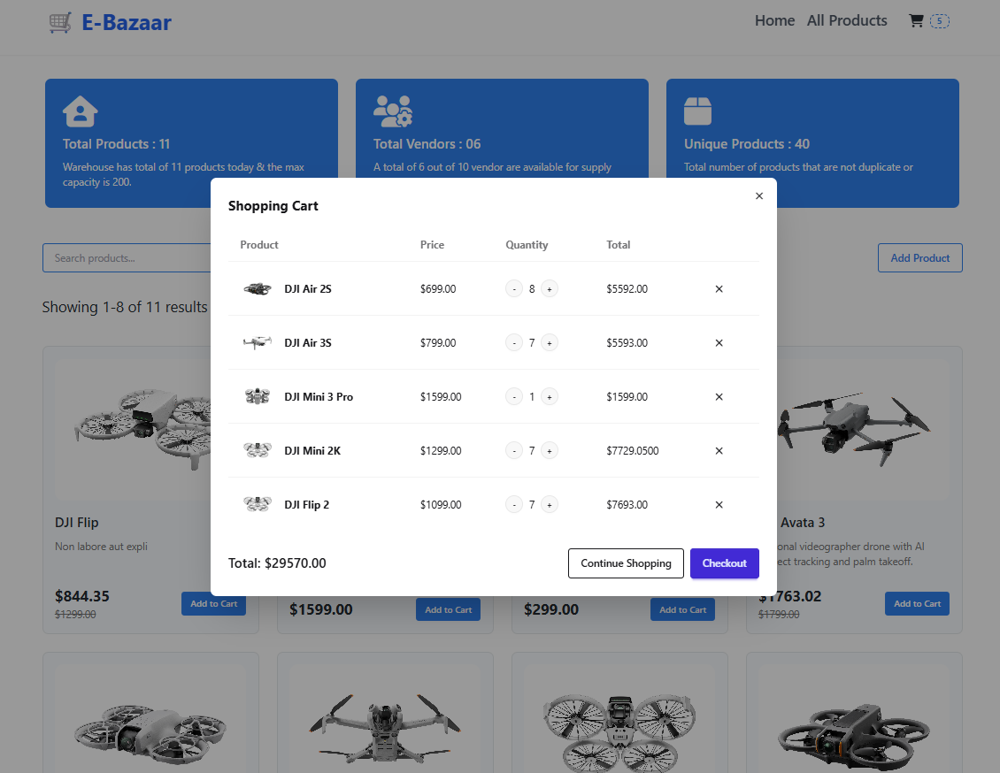

# eBazaar E-Commerce Platform

A full-stack e-commerce application built with .NET 8.0, featuring product management, shopping cart, and dynamic discounts.

## Tech Stack

- **Frontend**: .NET Core Razor Pages with Tailwind CSS
- **Backend**: ASP.NET Core Web API
- **Database**: MSSQL Server
- **ORM**: Entity Framework Core
- **API Documentation**: Swagger/OpenAPI
- **Framework**: .NET 8.0

## Features

- Product Management (Add, List, Search)
- Shopping Cart Functionality
- Dynamic Discount System based on Dates
- Pagination
- RESTful API Integration
- Responsive Design

## Project Structure

```
eBazaar/
├── eBazaar.sln                        # Solution file
│
├── src/
│   ├── eBazaar.Web/                   # Razor Frontend Project
│   │   ├── wwwroot/                   # Static files (CSS, JS, images)
│   │   ├── Pages/
│   │   │   ├── Index.cshtml           # Homepage
│   │   │   ├── Products/
│   │   │   │   ├── List.cshtml        # Product listing + search + pagination
│   │   │   │   ├── Detail.cshtml      # Product details page
│   │   │   ├── Cart/
│   │   │   │   ├── Index.cshtml       # Cart view
│   │   ├── Models/                    # Shared models (Not implemented yet)
│   │   ├── Services/                  # API call services
│   │   └── appsettings.json
│   │
│   └── eBazaar.Api/                   # Web API Project
│       ├── Controllers/
│       │   ├── ProductsController.cs
│       │   └── CartController.cs
│       ├── Models/
│       │   ├── Product.cs
│       │   └── Cart.cs
│       ├── Data/
│       │   └── AppDbContext.cs
|       ├── Interfaces/
|       |   ├── IProductRepository.cs
|       |   └── ICartRepository.cs
│       ├── Repositories/
|       |   ├── ProductRepository.cs
|       |   └── CartRepository.cs
│       ├── appsettings.json
│       └── Program.cs      
│
└── README.md
```
## Setup Instructions

### Prerequisites
1. .NET 8.0 SDK
2. SQL Server 2019 or later
3. Node.js (for Tailwind CSS)
4. Visual Studio 2022 or VS Code

### Clone this repository
```bash
   git clone https://github.com/fahimreza71/E-Bazaar.git
```

### Database Setup
1. Update connection string in `appsettings.json`:
   ```json
   {
     "ConnectionStrings": {
       "DefaultConnection": "Server=.;Database=eBazaar;Trusted_Connection=True;MultipleActiveResultSets=true;TrustServerCertificate=true"
     }
   }
   ```
2. Run migrations:
   ```bash
   cd src/eBazaar.Api
   dotnet ef database update
   ```

### Development Setup

```bash
# Restore dependencies
dotnet restore

# Run the API
cd src/eBazaar.API
dotnet run

# Run the Web App
cd src/eBazaar.Web
dotnet run
```

### UI Preview  
<div style="display: flex; justify-content: center;">
  
  
  
</div>


